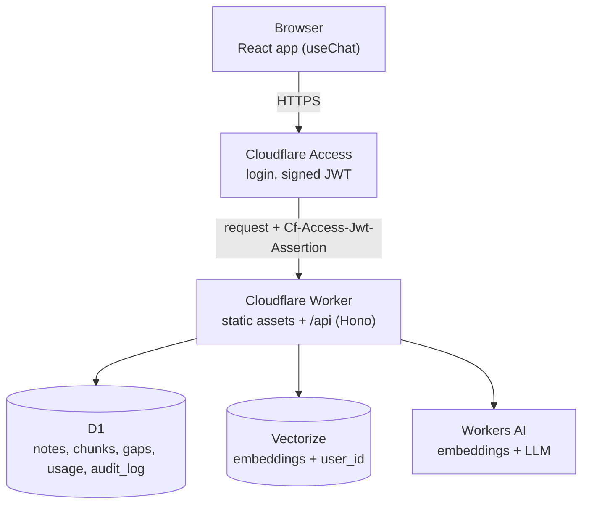

# Notes AI

A private notes app you can ask questions. Paste in notes or documents, then ask in plain language; answers are generated only from your own notes and show which note they came from.

It runs entirely on Cloudflare's free tier (Workers, D1, Vectorize, Workers AI, Access) and, for development, entirely on your own machine with [Ollama](https://ollama.com).

## Features

- Add notes by pasting text or uploading a PDF, Word (.docx), text or Markdown file, up to 1 MB of text each.
- List and delete notes.
- Ask questions and get streamed answers grounded in your notes, with the source note and chunk shown under each answer.
- Ask across all your notes, or pick one note in the chat box to ask about only that one.
- Follow-up questions keep the context of the conversation.
- Verified quotes: each answer shows passages from your notes that back it up, and each passage is marked as verified only after the server finds it word for word in the note.
- Gaps: questions your notes couldn't answer are listed, so you can see what is worth adding. A gap closes when you ask it again and get an answer, and is flagged when a note you add looks likely to answer it.
- Every user sees only their own notes. Login is handled by Cloudflare Access: anyone can sign in with a code sent to their email, or access can be restricted to chosen people.
- Per-user limits (20 notes, 30 questions a day by default) keep one person from using up the shared free allowances.
- Works on phones, with light and dark themes.

## Architecture



One Worker serves both the built frontend and the API, so there is a single origin and a single deploy. Access sits in front of everything: a request without a valid login never reaches the Worker.

In local development, Ollama stands in for Workers AI, a table in the local D1 database stands in for Vectorize, and login is bypassed. The code is the same; only configuration differs.

### Adding a note

1. For an uploaded file, the browser extracts the text; the file itself is never sent to the server.
2. Text larger than about 48 KB is sent as a series of parts. The first request creates the note and the rest append to it, so each request stays small.
3. Each part is cleaned (unicode normalised, whitespace collapsed) and checked against the size limits.
4. It is split into chunks of about 250 tokens, each overlapping the previous one by about 40.
5. Each chunk is embedded into a 768-dimension vector.
6. Vectors are stored in the vector index, tagged with the user's ID.
7. The note text, its chunks and an audit row are written to D1 in one transaction.

### Asking a question

1. The question is embedded with the same model.
2. The vector index returns the 5 most similar chunks, filtered to the current user and, if a note is selected, to that note.
3. The chunk text is read from D1, again filtered by user. If the search finds nothing although the user has note text stored, the index has not caught up with a recent upload: the app shows "still being indexed" and retries every 3 seconds for up to 45 seconds.
4. The model is told to answer only from those chunks, to say "I don't know" otherwise, and to end its reply with a `QUOTES:` section of passages copied from them. Replies are capped at 700 tokens; Workers AI otherwise stops at 256, which is too short for an answer plus quotes.
5. The answer streams to the browser. The `QUOTES:` section is cut out of the stream as it passes, so it is never displayed as the model wrote it.
6. When the reply is complete, the chunks that scored well enough are sent as its sources, and the quotes are checked and sent (see below).

### Verified quotes

The model's quotes are treated as claims to check, never as facts.

1. Each quote is looked up in the text of the chunks the model was given. Case, spacing and quotation-mark style are ignored; the wording must match. A quote may skip text with "..." if every part appears, in order, within one chunk.
2. A quote that is found is shown as verified, with the note it came from. One that is not found is shown as "not found word for word", so a loose paraphrase is visible instead of hidden.
3. If none of the model's quotes is verified, or it gave none, the server picks the sentences from the cited chunks that share the most key terms with the answer. These are copied from the note text, so they are exact by construction.
4. If the model skips the answer and writes only quotes, the verified ones are shown as the answer.

Because of steps 3 and 4, the feature does not depend on the model following the format.

It does not depend on the reply ending cleanly either. Sources and quotes are worked out from whatever text arrived, so a reply that is cut off, or fails after the answer is on screen, still shows them and is not reported as an error.

### Gaps

1. When the model replies "I don't know", the question is saved with its embedding and the score of the best chunk it was offered. Repeats of a question raise its count; messages under three words and small talk such as greetings are ignored.
2. When a later answer to the same question is not "I don't know", the gap is deleted.
3. When note text is added, its chunks are compared with the open gaps. A gap is flagged with that note if a chunk matches its question clearly better than the best match it had before. This is a hint only; step 2 is what closes a gap.

## Tech stack

| Layer | Technology |
|---|---|
| Backend | Cloudflare Worker, TypeScript, [Hono](https://hono.dev) |
| AI calls | [AI SDK](https://ai-sdk.dev) with an OpenAI-compatible provider |
| Models (production) | Workers AI: `@cf/meta/llama-3.3-70b-instruct-fp8-fast`, `@cf/baai/bge-base-en-v1.5` |
| Models (local) | Ollama: `llama3`, `nomic-embed-text` |
| Database | Cloudflare D1 (SQLite) |
| Vector index | Cloudflare Vectorize (768 dimensions, cosine) |
| Authentication | Cloudflare Access; the Worker verifies the JWT with `jose` |
| Frontend | React, Vite, Tailwind CSS, shadcn/ui, AI Elements, `react-markdown` |
| CI/CD | Cloudflare Workers Builds (deploys on push to `main`) |

## Project structure

```
├── backend/                 Backend (Cloudflare Worker)
│   ├── db/
│   │   ├── schema.sql       D1 tables: notes, chunks, gaps, usage, audit_log
│   │   └── schema.local.sql Local-only table that stands in for Vectorize
│   ├── src/
│   │   ├── index.ts         App wiring: CORS, body limit, auth, routes
│   │   ├── routes/          HTTP handlers
│   │   ├── middleware/      Authentication, rate limiting, error handling
│   │   ├── validation/      Request parsing and input limits
│   │   ├── services/        Notes, chat (retrieval and answer), gaps, quotas, audit log
│   │   ├── lib/             JWT verification, AI calls, chunking, quotes, reply stream, vector store
│   │   └── shared/          API types, limits and note splitting, also imported by the frontend
│   ├── test/                Unit tests, mirroring src/
│   ├── wrangler.toml        Worker configuration and bindings
│   └── .dev.vars.example    Local settings template
└── frontend/                React app
    └── src/
        ├── components/      notes-panel, chat-panel, gaps-list, ui/, ai-elements/
        ├── hooks/           use-notes, use-gaps, use-theme
        └── lib/             API client, reading uploaded files, formatting
```

## Run it locally

### Prerequisites

- Node.js 24
- [Ollama](https://ollama.com), running, with both models pulled:

```sh
ollama pull llama3
ollama pull nomic-embed-text
```

`llama3` is about 4.7 GB and runs best on a GPU with 8 GB of memory.

### Setup

```sh
cd frontend
npm install                          # frontend dependencies
npm run build                        # build the frontend into frontend/dist

cd ../backend
npm install                          # worker dependencies
cp .dev.vars.example .dev.vars       # local settings
npm run db:init                      # create the local database tables
npm run dev                          # start the app
```

Open <http://127.0.0.1:8787> for the landing page, or <http://127.0.0.1:8787/app> for the app itself. You are signed in as `dev@localhost`; there is no login locally.

`wrangler dev` prints a warning that Vectorize bindings are not supported locally. That is expected: locally the vectors live in the D1 table from `schema.local.sql`.

Run `npm run db:init` again if `database_id` in `wrangler.toml` changes, because the local database is stored under that ID.

### Working on the frontend

Run the API and the Vite dev server in two terminals, then open <http://localhost:5173> for live reload. The app is at `/app`; every other path shows the landing page.

```sh
cd backend && npm run dev      # API on port 8787
cd frontend && npm run dev    # frontend on port 5173, proxying /api to the API
```

The Worker needs the `frontend/dist` folder to exist before it starts, so build the frontend once first.

### Commands

| Folder | Command | What it does |
|---|---|---|
| `backend/` | `npm run dev` | Run the Worker locally, serving the built frontend |
| `backend/` | `npm run db:init` | Create the local D1 tables |
| `backend/` | `npm run typecheck` | Type-check the Worker |
| `backend/` | `npm test` | Run the Worker's unit tests |
| `backend/` | `npm run deploy` | Deploy from your machine; build the frontend first (normally a push to `main` does both) |
| `frontend/` | `npm run dev` | Run the Vite dev server |
| `frontend/` | `npm run build` | Type-check and build the frontend |
| `frontend/` | `npm run lint` | Lint the frontend |

## Configuration

Locally, all values come from `backend/.dev.vars`. In production they come from three places.

| Variable | Purpose | Production value | Set in |
|---|---|---|---|
| `LLM_MODEL` | Chat model | `@cf/meta/llama-3.3-70b-instruct-fp8-fast` | `wrangler.toml` |
| `EMBEDDING_MODEL` | Embedding model | `@cf/baai/bge-base-en-v1.5` | `wrangler.toml` |
| `EMBEDDING_DIMENSIONS` | Vector size the embedding model produces; must match the Vectorize index | `768` when unset | `wrangler.toml` |
| `CITATION_MIN_SCORE` | Lowest similarity score shown as a source | `0.56` | `wrangler.toml` |
| `AUTH_ENABLED` | Login is enforced unless this is exactly `false` | `true` | `wrangler.toml` |
| `VECTOR_STORE` | `vectorize` or `local` | `vectorize` | `wrangler.toml` |
| `MAX_NOTES_PER_USER` | Most notes one user can have | `20` | `wrangler.toml` |
| `MAX_CHUNKS_PER_USER` | Most chunks one user's notes can hold in total (about 0.9 KB of text each) | `1000` | `wrangler.toml` |
| `MAX_QUESTIONS_PER_DAY` | Most questions one user can ask per UTC day | `30` | `wrangler.toml` |
| `LLM_BASE_URL` | OpenAI-compatible API base URL | `https://api.cloudflare.com/client/v4/accounts/<ACCOUNT_ID>/ai/v1` | dashboard |
| `ACCESS_TEAM_DOMAIN` | Your Access team domain | `https://<team>.cloudflareaccess.com` | dashboard |
| `ACCESS_AUD` | Audience tag of the Access application | from the Worker's Access tab | dashboard |
| `ALLOWED_ORIGIN` | The only origin allowed by CORS | `https://<worker>.<subdomain>.workers.dev` | dashboard |
| `LLM_API_KEY` | Workers AI API token | secret | dashboard, as a Secret |

`wrangler.toml` sets `keep_vars = true`. Without it, each deploy would delete the variables that exist only in the dashboard, and the app would reject every request.

`CITATION_MIN_SCORE` differs per environment because embedding models score on different scales: `0.56` suits `bge-base`, and the local default of `0.48` suits `nomic-embed-text`.

## Deploy to Cloudflare

Everything here fits in the free plans. To deploy your own copy:

1. **D1.** In the dashboard, create a database named `notes-ai-db` and run `backend/db/schema.sql` in its console. Put the database ID in `backend/wrangler.toml`.
2. **Vectorize.** The dashboard cannot create indexes, so this step needs the CLI. Create both metadata indexes before adding any notes: a vector inserted before an index existed is invisible to that index's filter until its note is deleted and added again.

   ```sh
   cd backend
   npx wrangler login
   npx wrangler vectorize create notes-ai-index --dimensions=768 --metric=cosine
   npx wrangler vectorize create-metadata-index notes-ai-index --property-name=user_id --type=string
   npx wrangler vectorize create-metadata-index notes-ai-index --property-name=note_id --type=string
   ```

3. **Workers Builds.** Push the repository to GitHub, then in Workers & Pages choose Create → Import a repository, with:

   | Setting | Value |
   |---|---|
   | Project name | `notes-ai` (must match `name` in `wrangler.toml`) |
   | Root directory | `backend` |
   | Build command | `npm --prefix ../frontend ci && npm --prefix ../frontend run build` |
   | Deploy command | `npx wrangler deploy` |
   | Protect with Cloudflare Access | on, scope "All traffic" |

4. **Access.** Choose who may log in. The policy created by the toggle, "Cloudflare account members", allows only members of your account. To change it, activate the free Zero Trust plan (up to 50 users), create a policy under Access controls → Policies, and attach it to the application: Include "Everyone" lets anyone sign in with an emailed code, and Include "Emails" restricts it to the addresses you list.
5. **Workers AI token.** Under API Tokens, create a token from the "Workers AI" template.
6. **Variables.** In the Worker's Settings → Variables and Secrets, add the five dashboard values from the table above, with `LLM_API_KEY` as a Secret.

After that, every push to `main` builds and deploys automatically.

## API

All routes are under `/api`, require a logged-in user, and return errors as `{ "error": "message" }`.

| Method | Path | Description |
|---|---|---|
| `GET` | `/api/me` | The current user's ID (their email) and whether there is a session to sign out of |
| `GET` | `/api/notes` | List the user's notes |
| `POST` | `/api/notes` | Add a note: `{ "title"?: string, "content": string }` |
| `POST` | `/api/notes/:id/parts` | Append more text to a note: `{ "content": string }` |
| `DELETE` | `/api/notes/:id` | Delete a note with its chunks and vectors |
| `GET` | `/api/gaps` | List the questions the user's notes could not answer |
| `DELETE` | `/api/gaps/:id` | Dismiss a gap |
| `POST` | `/api/chat` | Ask a question; body and response follow the AI SDK `useChat` protocol. An optional `noteId` in the body limits the search to that note |

## Security

- **Authentication.** Cloudflare Access blocks unauthenticated requests at the edge. The Worker also verifies the token's signature, issuer and audience, so a request that reached it another way could not forge an identity.
- **Data isolation.** Every D1 query filters by `user_id`, and every Vectorize query filters on `user_id` metadata, including when a question is limited to one note. Deleting a note that belongs to someone else returns "not found".
- **Secrets.** The Workers AI token is a Worker Secret. The browser never calls the AI API; all model calls go through the Worker. `.dev.vars` is gitignored.
- **Input limits.** Notes up to 1 MB of text in total and 100 KB per request, titles up to 200 characters, questions up to 500 characters, request bodies up to 256 KB.
- **Rate limiting.** Per user, 20 questions per minute and 60 note-upload requests per minute. These are the two actions that use Workers AI; a 1 MB note takes about 22 upload requests.
- **Quotas.** Per user, 20 notes, 1,000 chunks of note text (about 1.5 MB) and 30 questions per UTC day, all configurable. The question count is kept in D1 and incremented and checked in one statement, so simultaneous requests cannot slip past it.
- **Prompt control.** Only the server sets the system prompt; a client message with the `system` role is rejected.
- **Injection.** All SQL uses prepared statements. Model output is rendered as markdown with raw HTML disabled.
- **Audit log.** Every note creation and deletion is recorded in `audit_log` with the user and time.

## Limitations

- **New notes are not searchable instantly in production.** Vectorize indexes in the background, which can take up to a minute. A question asked in that window waits for the note, up to 45 seconds, and then asks you to try again. Two cases are not covered: while a large upload is still being indexed, an answer may draw on only the parts indexed so far; and a deleted note can keep appearing in answers for a short time.
- **Notes cannot be viewed or edited** after they are added; the list shows only title, date and size.
- **Gaps are recorded by wording.** A follow-up such as "and how often?" is saved as its own gap even though it only made sense in its conversation, and two differently worded versions of one question are two gaps. Each can be dismissed.
- **Follow-up questions retrieve on the latest message only**, so a short follow-up such as "and when is it?" finds weaker matches than a full question.
- **The source cutoff is tuned on a small sample.** A correct answer whose best match scores below `CITATION_MIN_SCORE` is shown without sources.
- **A verified quote is proven to be in the note, not proven to be the best support.** The check confirms the wording exists in your notes; choosing which passage to quote is still the model's judgement, or a keyword match in the fallback.
- **Quotes can include a section heading.** Notes are stored as running text, so a heading that sat on its own line can appear at the start of the sentence after it.
- **The larger chat model uses the free Workers AI allowance about twice as fast** as the 8B model it replaced.
- **Token counts are estimated** (about 4 characters per token), so chunks are somewhat shorter than 500 real tokens.
- **Free-tier quota is shared by all users.** The daily Workers AI allowance covers roughly 115 questions in total, so the per-user limit of 30 slows one person down but four busy users can still exhaust it. Questions and new notes then fail with an error until it resets.
- **The free Zero Trust plan allows 50 users.** Each distinct person who signs in takes a seat; after 50, new people are blocked until seats are freed or the plan is upgraded.
- **Tests cover the logic, not the wiring.** The unit tests in `backend/test` cover text cleaning and chunking, splitting uploads into parts, quote checking, the reply stream and the retry loop. Routes, database queries and the frontend are tested by hand.
- **Scanned documents are not supported.** A PDF that contains only images of pages has no text to extract. Old Word files (.doc) are not supported either.
- **Free-tier storage is small.** Vectorize's free plan holds roughly 6,500 chunks across all users, about 10 MB of note text. A single user is capped at 1,000 chunks, but there is no check on the total, so seven users at their cap would fill the index.
- **A failed upload is rolled back by the browser.** If a large upload fails partway and the clean-up request fails too, a partial note remains and has to be deleted by hand.
- **Not yet verified in production:** the rate limits (tested locally only), and preview deployments for pull requests.
