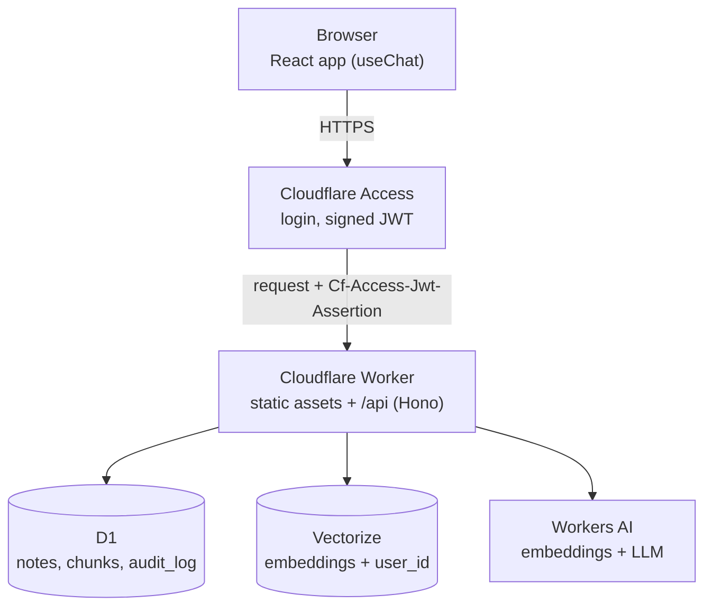

# Notes AI

A private notes app you can ask questions. Paste in notes or documents, then ask in plain language; answers are generated only from your own notes and show which note they came from.

It runs entirely on Cloudflare's free tier (Workers, D1, Vectorize, Workers AI, Access) and, for development, entirely on your own machine with [Ollama](https://ollama.com).

## Features

- Add, list and delete text notes of up to 100 KB each.
- Ask questions and get streamed answers grounded in your notes, with the source note and chunk shown under each answer.
- Follow-up questions keep the context of the conversation.
- Every user sees only their own notes. Login is handled by Cloudflare Access.
- Works on phones, with light and dark themes.

## Architecture



One Worker serves both the built frontend and the API, so there is a single origin and a single deploy. Access sits in front of everything: a request without a valid login never reaches the Worker.

In local development, Ollama stands in for Workers AI, a table in the local D1 database stands in for Vectorize, and login is bypassed. The code is the same; only configuration differs.

### Adding a note

1. The text is cleaned (unicode normalised, whitespace collapsed) and checked against the size limit.
2. It is split into chunks of about 500 tokens, each overlapping the previous one by about 50.
3. Each chunk is embedded into a 768-dimension vector.
4. Vectors are stored in the vector index, tagged with the user's ID.
5. The note, its chunks and an audit row are written to D1 in one transaction.

### Asking a question

1. The question is embedded with the same model.
2. The vector index returns the 5 most similar chunks, filtered to the current user.
3. The chunk text is read from D1, again filtered by user.
4. The model is told to answer only from those chunks, and to say "I don't know" otherwise.
5. The answer streams to the browser. When it finishes, the chunks that scored well enough are sent as its sources.

## Tech stack

| Layer | Technology |
|---|---|
| Backend | Cloudflare Worker, TypeScript, [Hono](https://hono.dev) |
| AI calls | [AI SDK](https://ai-sdk.dev) with an OpenAI-compatible provider |
| Models (production) | Workers AI: `@cf/meta/llama-3.1-8b-instruct-fp8`, `@cf/baai/bge-base-en-v1.5` |
| Models (local) | Ollama: `llama3`, `nomic-embed-text` |
| Database | Cloudflare D1 (SQLite) |
| Vector index | Cloudflare Vectorize (768 dimensions, cosine) |
| Authentication | Cloudflare Access; the Worker verifies the JWT with `jose` |
| Frontend | React, Vite, Tailwind CSS, shadcn/ui, AI Elements, `react-markdown` |
| CI/CD | Cloudflare Workers Builds (deploys on push to `main`) |

## Project structure

```
├── worker/                  Backend (Cloudflare Worker)
│   ├── db/
│   │   ├── schema.sql       D1 tables: notes, chunks, audit_log
│   │   └── schema.local.sql Local-only table that stands in for Vectorize
│   ├── src/
│   │   ├── index.ts         App wiring: CORS, body limit, auth, routes
│   │   ├── routes/          HTTP handlers
│   │   ├── middleware/      Authentication, rate limiting, error handling
│   │   ├── validation/      Request parsing and input limits
│   │   ├── services/        Notes, chat (retrieval and answer), audit log
│   │   └── lib/             JWT verification, AI calls, chunking, vector store
│   ├── wrangler.toml        Worker configuration and bindings
│   └── .dev.vars.example    Local settings template
├── frontend/                React app
│   └── src/
│       ├── components/      notes-panel, chat-panel, ui/, ai-elements/
│       ├── hooks/           use-notes, use-theme
│       └── lib/             API client, formatting
├── shared/types.ts          API types and limits used by both sides
└── package.json             Shortcut scripts for the two packages
```

## Run it locally

### Prerequisites

- Node.js 24
- [Ollama](https://ollama.com), running, with both models pulled:

```sh
ollama pull llama3
ollama pull nomic-embed-text
```

`llama3` is about 4.7 GB and runs best on a GPU with 8 GB of memory.

### Setup

```sh
npm run setup                                    # install worker and frontend dependencies
cp worker/.dev.vars.example worker/.dev.vars     # local settings
npm run db:init                                  # create the local database tables
npm run build                                    # build the frontend
npm run dev                                      # start the app
```

Open <http://127.0.0.1:8787>. You are signed in as `dev@localhost`; there is no login locally.

`wrangler dev` prints a warning that Vectorize bindings are not supported locally. That is expected: locally the vectors live in the D1 table from `schema.local.sql`.

Run `npm run db:init` again if `database_id` in `wrangler.toml` changes, because the local database is stored under that ID.

### Working on the frontend

Run the API and the Vite dev server in two terminals, then open <http://localhost:5173> for live reload:

```sh
npm run dev        # API on port 8787
npm run dev:web    # frontend on port 5173, proxying /api to the API
```

### Commands

| Command | What it does |
|---|---|
| `npm run setup` | Install dependencies for `worker/` and `frontend/` |
| `npm run dev` | Run the Worker locally, serving the built frontend |
| `npm run dev:web` | Run the Vite dev server |
| `npm run build` | Type-check and build the frontend |
| `npm run db:init` | Create the local D1 tables |
| `npm run typecheck` | Type-check the Worker |
| `npm test` | Run the Worker's unit tests |
| `npm run deploy` | Build and deploy from your machine (normally a push to `main` does this) |

## Configuration

Locally, all values come from `worker/.dev.vars`. In production they come from three places.

| Variable | Purpose | Production value | Set in |
|---|---|---|---|
| `LLM_MODEL` | Chat model | `@cf/meta/llama-3.1-8b-instruct-fp8` | `wrangler.toml` |
| `EMBEDDING_MODEL` | Embedding model; must produce 768 dimensions | `@cf/baai/bge-base-en-v1.5` | `wrangler.toml` |
| `CITATION_MIN_SCORE` | Lowest similarity score shown as a source | `0.56` | `wrangler.toml` |
| `AUTH_ENABLED` | Login is enforced unless this is exactly `false` | `true` | `wrangler.toml` |
| `VECTOR_STORE` | `vectorize` or `local` | `vectorize` | `wrangler.toml` |
| `LLM_BASE_URL` | OpenAI-compatible API base URL | `https://api.cloudflare.com/client/v4/accounts/<ACCOUNT_ID>/ai/v1` | dashboard |
| `ACCESS_TEAM_DOMAIN` | Your Access team domain | `https://<team>.cloudflareaccess.com` | dashboard |
| `ACCESS_AUD` | Audience tag of the Access application | from the Worker's Access tab | dashboard |
| `ALLOWED_ORIGIN` | The only origin allowed by CORS | `https://<worker>.<subdomain>.workers.dev` | dashboard |
| `LLM_API_KEY` | Workers AI API token | secret | dashboard, as a Secret |

`wrangler.toml` sets `keep_vars = true`. Without it, each deploy would delete the variables that exist only in the dashboard, and the app would reject every request.

`CITATION_MIN_SCORE` differs per environment because embedding models score on different scales: `0.56` suits `bge-base`, and the local default of `0.48` suits `nomic-embed-text`.

## Deploy to Cloudflare

Everything here fits in the free plans. To deploy your own copy:

1. **D1.** In the dashboard, create a database named `notes-ai-db` and run `worker/db/schema.sql` in its console. Put the database ID in `worker/wrangler.toml`.
2. **Vectorize.** The dashboard cannot create indexes, so this step needs the CLI. Create the metadata index before adding any notes; vectors inserted earlier are not covered by the per-user filter.

   ```sh
   cd worker
   npx wrangler login
   npx wrangler vectorize create notes-ai-index --dimensions=768 --metric=cosine
   npx wrangler vectorize create-metadata-index notes-ai-index --property-name=user_id --type=string
   ```

3. **Workers Builds.** Push the repository to GitHub, then in Workers & Pages choose Create → Import a repository, with:

   | Setting | Value |
   |---|---|
   | Project name | `notes-ai` (must match `name` in `wrangler.toml`) |
   | Root directory | `worker` |
   | Build command | `npm --prefix ../frontend ci && npm --prefix ../frontend run build` |
   | Deploy command | `npx wrangler deploy` |
   | Protect with Cloudflare Access | on, scope "All traffic" |

4. **Access.** Choose who may log in. The "Cloudflare account" policy allows only members of your account; add specific email addresses in Zero Trust to invite others.
5. **Workers AI token.** Under API Tokens, create a token from the "Workers AI" template.
6. **Variables.** In the Worker's Settings → Variables and Secrets, add the five dashboard values from the table above, with `LLM_API_KEY` as a Secret.

After that, every push to `main` builds and deploys automatically.

## API

All routes are under `/api`, require a logged-in user, and return errors as `{ "error": "message" }`.

| Method | Path | Description |
|---|---|---|
| `GET` | `/api/me` | The current user's ID (their email) |
| `GET` | `/api/notes` | List the user's notes |
| `POST` | `/api/notes` | Add a note: `{ "title"?: string, "content": string }` |
| `DELETE` | `/api/notes/:id` | Delete a note with its chunks and vectors |
| `POST` | `/api/chat` | Ask a question; body and response follow the AI SDK `useChat` protocol |

## Security

- **Authentication.** Cloudflare Access blocks unauthenticated requests at the edge. The Worker also verifies the token's signature, issuer and audience, so a request that reached it another way could not forge an identity.
- **Data isolation.** Every D1 query filters by `user_id`, and every Vectorize query filters on `user_id` metadata. Deleting a note that belongs to someone else returns "not found".
- **Secrets.** The Workers AI token is a Worker Secret. The browser never calls the AI API; all model calls go through the Worker. `.dev.vars` is gitignored.
- **Input limits.** Notes up to 100 KB, titles up to 200 characters, questions up to 500 characters, request bodies up to 256 KB.
- **Rate limiting.** 20 requests per minute per user across asking questions and adding notes, the two actions that use Workers AI.
- **Prompt control.** Only the server sets the system prompt; a client message with the `system` role is rejected.
- **Injection.** All SQL uses prepared statements. Model output is rendered as markdown with raw HTML disabled.
- **Audit log.** Every note creation and deletion is recorded in `audit_log` with the user and time.

## Limitations

- **New notes are not searchable instantly in production.** Vectorize indexes in the background, usually within a few seconds. The same delay applies to deletions.
- **Notes cannot be viewed or edited** after they are added; the list shows only title, date and size.
- **Follow-up questions retrieve on the latest message only**, so a short follow-up such as "and when is it?" finds weaker matches than a full question.
- **The source cutoff is tuned on a small sample.** A correct answer whose best match scores below `CITATION_MIN_SCORE` is shown without sources.
- **Token counts are estimated** (about 4 characters per token), so chunks are somewhat shorter than 500 real tokens.
- **Free-tier quota.** When the daily Workers AI allowance runs out, questions and new notes fail with an error until it resets.
- **Test coverage is thin.** Only the text cleaning and chunking code has unit tests.
- **Not yet verified in production:** isolation between two different accounts, notes close to the 100 KB limit, and preview deployments for pull requests.
